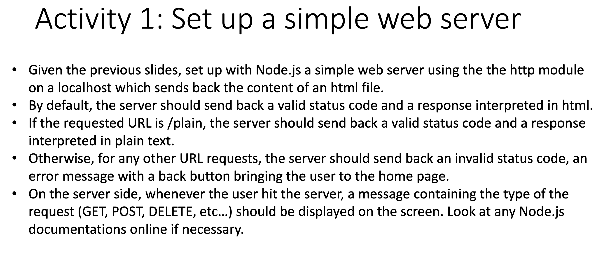
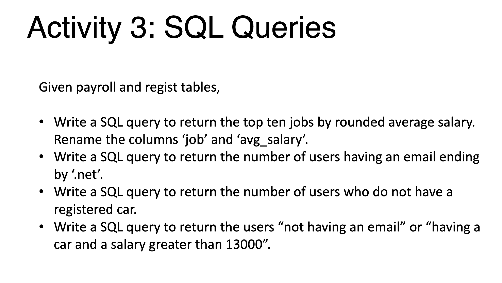
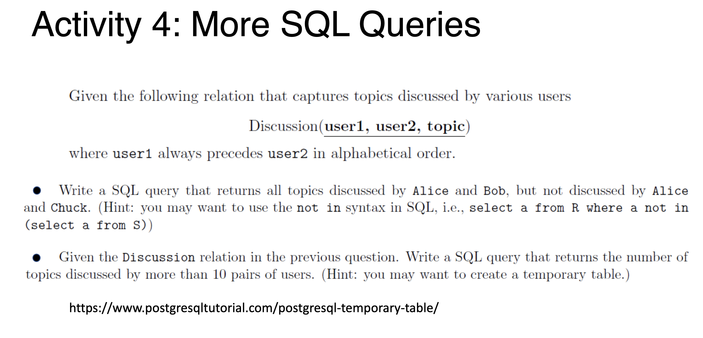
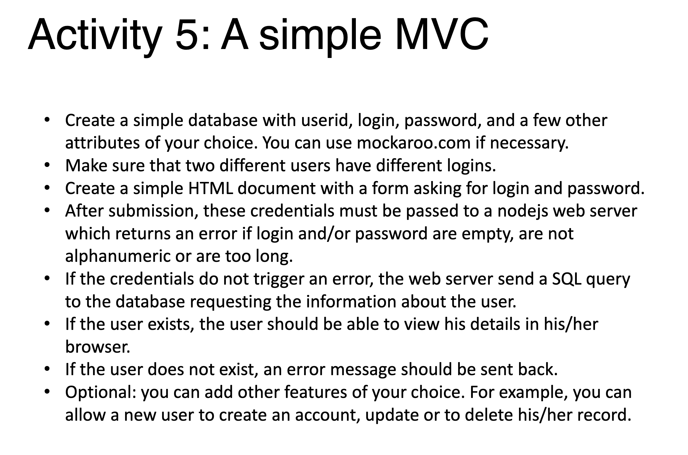

# BackendDev Homeworks for Day2
submitted by: James Ee

# Activity 1



```bash
$ npm run activity1
```

* Open browser at http://localhost:5000
* Type http://localhost:5000/plain
* Type http://localhost:5000/hello


# Activity 2


```bash
$ npm run activity2
```
* Open browser at http://localhost:5000


# Activity 3



```sql
SELECT jobs as 'job', ROUND(average_salary, 0) as 'avg_salary' 
FROM payroll 
ORDER BY avg_salary DESC LIMIT 10;
```

```sql
SELECT * FROM regist WHERE email LIKE '%.net';
```

```sql
SELECT COUNT(name) FROM regist WHERE registered_car IS NOT NULL;
```

```sql
SELECT users FROM regist WHERE email IS NULL AND registered_car IS NOT NULL AND salary > 13000;
```

# Activity 4



I do not comprehend what is expected of Activity4 questions.

# Activity 5




## Setup

```bash
$ git clone https://github.com/jamesee/BackendDev-hw-day2.git

$ cd BackendDev-hw-day2

# start postgres container
$ source postgres-docker.sh

$ cd activity5-frontend

# complie react frontend
$ npm install && npm run build

$ cd ..

$ npm install

$ npm run db:migrate

$ npm run activity5
```

Go to http://localhost:5000